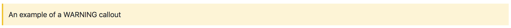
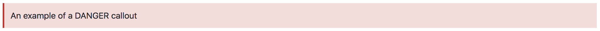

# CalloutCSS

A CDN, Bower and NPM component holding CSS definitions for callouts. No Javascript or dependencies, ideal
for use in any project which wants to add callout functionality.

## Usage:

CalloutCSS contains the definitions for three types of callouts; NOTE, WARNING and DANGER. Simply add the following snippets to produce callouts in your websites.

```html
<note-callout>
    An example of a NOTE callout
</note-callout>
```


```html
<warning-callout>
    An example of a WARNING callout
</warning-callout>
```


```html
<danger-callout>
    An example of a DANGER callout
</danger-callout>
```


Further customisations of the callouts can be found on the fully fleshed out <a href="https://theyorkshiredev.github.io/CalloutCSS/">examples documentation</a>.

## Installation:

#### CDN

```html
<link rel="stylesheet" href="https://cdn.jsdelivr.net/npm/calloutcss@1.0.0/dist/callout.min.css" integrity="sha256-SYSQemsIxvfjHJ04VeAy0VS4pH7i/0qZUwwz0vq5wXk= sha384-/RloR6ZLXi3i248Eyg42OhYXAkSHlAXR/5AhAV0zl8vq1kbnWFoiAuO+6065k9xA" crossorigin="anonymous">
```

#### Bower

```bash
$ bower install calloutcss
```

#### NPM

```bash
$ npm install calloutcss
```

## Development:

To pull and develop this package NPM and webpack is used to manage the development dependencies and
transpile the SCSS file into the final CSS distribution.

#### Setup Environment:

```bash
$ npm install
```

#### Build/Compile the SCSS:

```bash
$ npm run build
```

NOTE: `hack.js` is used as part of the build step generating `ignore.js`, however this is an
artefact of the build stage and is not packaged in releases. Unfortunately Webpack **MUST** have
a javascript entry point from which any (S)CSS is gathered and then output for distribution.

## Copyright and license

Code copyright 2018 TheYorkshireDev (Steven Cooney). Code released under
[the MIT license](https://github.com/TheYorkshireDev/CalloutCSS/blob/master/LICENSE).
